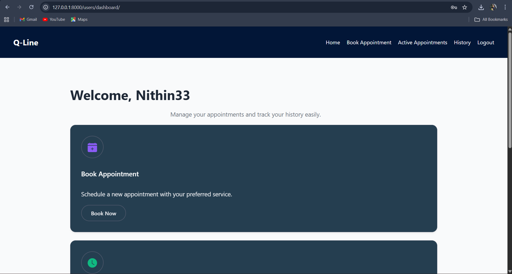
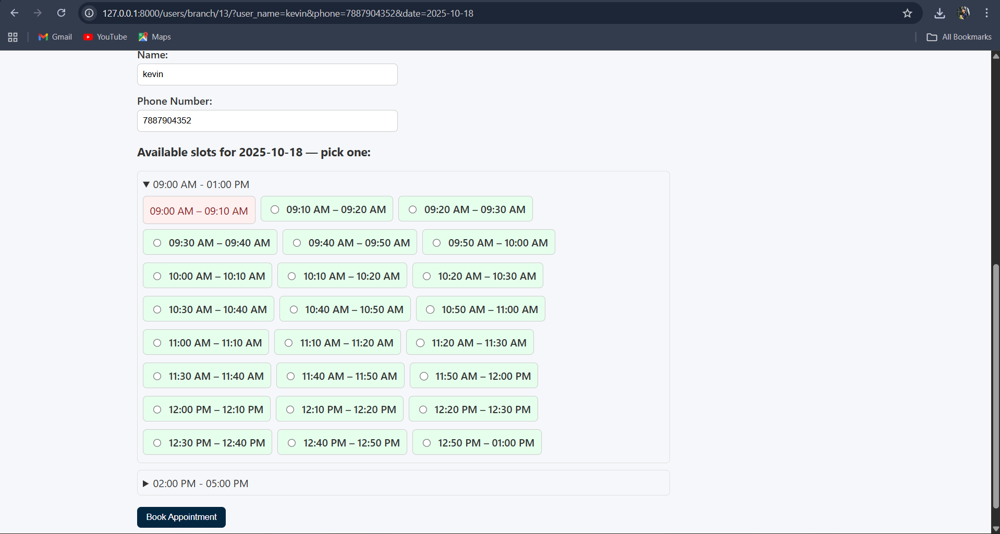
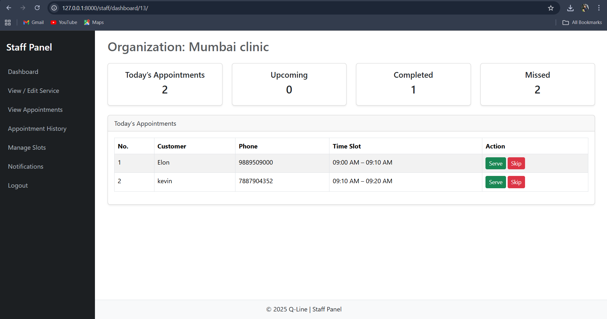

# Q-Line: Smart Queue & Appointment System

Q-Line is a dynamic, web-based smart queue and appointment management system designed to eliminate physical waiting lines and streamline the scheduling process for various services. The platform allows end-users to search for services by type and location, view available branches, and book specific time slots online with ease.

## Key Features

### For Users (Customers)
- **User Authentication**: Secure sign-up and login functionality.
- **Dynamic Service Search**: Find services by type (Clinic, Salon, etc.) and location.
- **Multi-Step Booking**: A seamless flow from selecting a branch to choosing a specific, auto-generated time slot.
- **Real-Time Availability**: View available (green) and booked (red) slots to prevent double-booking.
- **Appointment Management**: View active appointments and a complete history of past (completed/missed) bookings.

### For Staff (Service Providers)
- **Business Registration**: A two-step process to register a new service branch.
- **Staff Dashboard**: An at-a-glance view of today's, upcoming, completed, and missed appointments.
- **Live Queue Management**: Actions to **Serve**, **Skip**, and **Delete** appointments in real-time.
- **Schedule Control**: Manage working hours, add/edit/delete time slot groups, and set holidays.
- **Notifications**: Get notified about new bookings and status changes.

## Technology Stack

- **Backend**: Python, Django
- **Frontend**: HTML, CSS, JavaScript
- **Database**: SQLite 3
- **UI Framework**: Bootstrap

## Setup & Installation

To run this project locally, follow these steps:

1.  **Clone the repository:**
    ```bash
    git clone [https://github.com/Nithin050/Q-Line.git](https://github.com/Nithin050/Q-Line.git)
    ```
2.  **Navigate to the project directory:**
    ```bash
    cd Q-Line
    ```
3.  **Create and activate a virtual environment:**
    ```bash
    python -m venv env
    source env/bin/activate  # On Windows, use `env\Scripts\activate`
    ```
4.  **Install the required dependencies:**
    ```bash
    pip install -r requirements.txt
    ```
5.  **Apply the database migrations:**
    ```bash
    python manage.py migrate
    ```
6.  **Run the development server:**
    ```bash
    python manage.py runserver
    ```
The application will be available at `http://127.0.0.1:8000`.


## Screenshots

**User Dashboard**


**Booking Page**


**Staff Dashboard**

