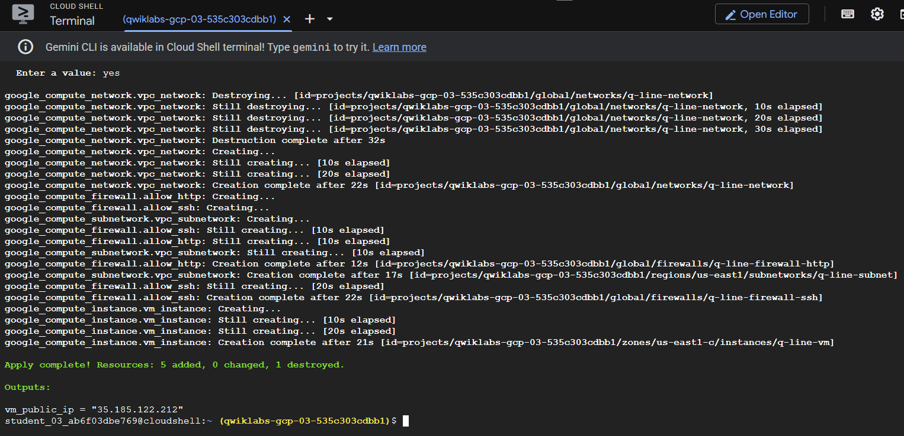
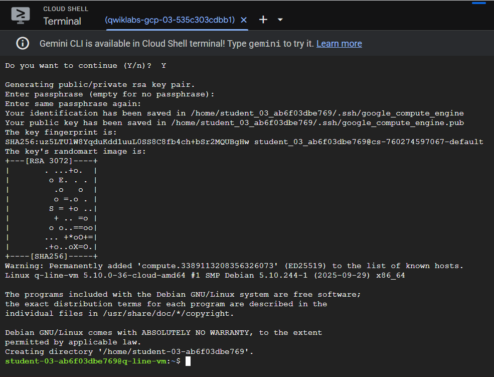
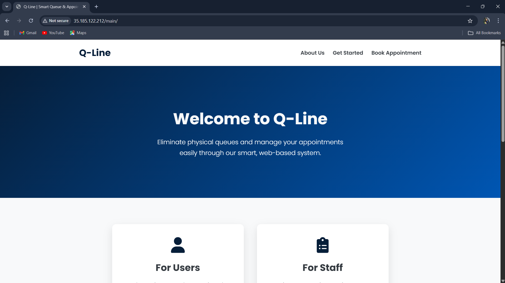

# Q-Line: Smart Queue & Appointment System

Q-Line is a dynamic, web-based smart queue and appointment management system designed to eliminate physical waiting queues and streamline the scheduling process for various services. The platform allows end-users to search for services by type and location, view available branches, and book specific time slots online with ease.
This repository contains the complete end-to-end project: the full-stack Django application, the Docker container configuration, and the Terraform "Infrastructure as Code" script used to deploy it to Google Cloud Platform.

* **Application Code:** The core Django app (inside the `/qline` folder).
* **Infrastructure Code:** See the `/qline/infrastructure` folder for the Terraform script.
* **Deployment Proof:** See the `/qline/deployment_proof` folder for live deployment screenshots.

## Key Application Features

### For Users (Customers)
* **User Authentication**: Secure sign-up and login functionality.
* **Dynamic Service Search**: Find services by type (Clinic, Salon, etc.) and location.
* **Multi-Step Booking**: A seamless flow from selecting a branch to choosing a specific, auto-generated time slot.
* **Real-Time Availability**: View available (green) and booked (red) slots to prevent double-booking.
* **Appointment Management**: View active appointments and a complete history of past (completed/missed) bookings.

### For Staff (Service Providers)
* **Business Registration**: A two-step process to register a new service branch.
* **Staff Dashboard**: An at-a-glance view of today's, upcoming, completed, and missed appointments.
* **Live Queue Management**: Actions to `Serve`, `Skip`, and `Delete` appointments in real-time.
* **Schedule Control**: Manage working hours, add/edit/delete time slot groups, and set holidays.
* **Notifications**: Get notified about new bookings and status changes.

## Technology Stack

* **Backend**: Python, Django
* **Frontend**: HTML, CSS, JavaScript, Bootstrap
* **Database**: SQLite 3
* **Containerization**:	Docker, Gunicorn, WhiteNoise
* **Deployment(Cloud & DevOps)**: Google Cloud Platform (GCP), Terraform (IaC)


## Application Screenshots

**User Dashboard**


**Booking Page**


**Staff Dashboard**


## Setup & Installation

There are two ways to run this project. The recommended method is using Docker.

### Recommended Setup (Docker)

This is the simplest way to run the application as it's intended for production.

1.  **Clone the repository:**
    ```bash
    git clone [https://github.com/Nithin050/Q-Line.git](https://github.com/Nithin050/Q-Line.git)
    cd Q-Line/qline
    ```
2.  **Ensure Docker Desktop is running.**

3.  **Build the Docker image:**
    ```bash
    docker build -t q-line-app .
    ```
4.  **Run the container:**
    ```bash
    docker run -p 8000:8000 q-line-app
    ```
5.  The application will be available at `http://localhost:8000/main/`.

### Manual/Legacy Setup (For Development)

This method is for running the app without Docker, using a local Python environment.

1.  **Clone the repository:**
    ```bash
    git clone [https://github.com/Nithin050/Q-Line.git](https://github.com/Nithin050/Q-Line.git)
    ```
2.  **Navigate to the project directory:**
    ```bash
    cd Q-Line/qline
    ```
3.  **Create and activate a virtual environment:**
    ```bash
    python -m venv env
    source env/bin/activate  # On Windows, use env\Scripts\activate
    ```
4.  **Install the required dependencies:**
    ```bash
    pip install -r requirements.txt
    ```
5.  **Apply the database migrations:**
    ```bash
    python manage.py migrate
    ```
6.  **Run the development server:**
    ```bash
    python manage.py runserver
    ```
The application will be available at `http://127.0.0.1:8000/main/`.

# End-to-End Cloud Deployment (GCP + Terraform)

This application was successfully deployed to a live public IP on Google Cloud Platform using a full CI/CD and DevOps methodology.

### Step 1: Containerization (Docker)
The production-ready Django app (using Gunicorn and WhiteNoise) was containerized using the `Dockerfile` located in the `/qline` folder.

### Step 2: Infrastructure as Code (Terraform)
I wrote the Terraform script in the `/qline/infrastructure` folder to automatically provision all cloud resources. This script built:
* A new VPC network (`q-line-network`) and subnetwork (`q-line-subnet`).
* Firewall rules for HTTP (port 80) and SSH (port 22).
* A `e2-micro` Compute Engine VM (`q-line-vm`) with a startup script to automatically install Docker.

The `terraform apply` command successfully built the server and output its public IP address:



### Step 3: Secure Access & Deployment (SSH & Docker)
I then securely connected to the new VM via SSH, cloned this repository, and ran the Docker container.



# 1. Clone the repo
```bash
git clone [https://github.com/Nithin050/Q-Line.git](https://github.com/Nithin050/Q-Line.git)
```

# 2. Build the image (from within the 'qline' sub-folder)
```bash
cd Q-Line/qline
sudo docker build -t q-line-app .
```

# 3. Run the container
```bash
sudo docker run -d -p 80:8000 q-line-app
```

### Step 4: Live on the Web
The Q-Line application was fully deployed and accessible on its public IP address (35.185.122.212), proving the deployment was a success.



(Note: The server was temporary as it was deployed on a Qwiklabs free lab environment.)
